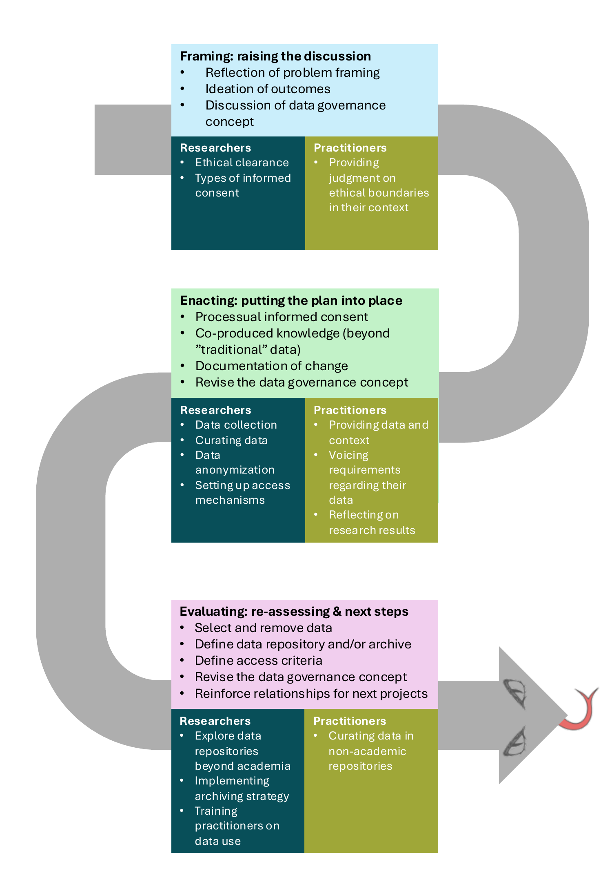

# tdgovernance: Data Governance Concept Template for Transdisciplinary Research

<!-- badges: start -->

<!-- badges: end -->

## About the template

The tdgovernance repository holds a template for a Data Governance Concept and a figure of its three phases. A Data Governance Concept is a document that the researchers and practitioners of a transdisciplinary project write together. In the document they agree on how they handle the data of the project, e.g., who takes part in decisions about the data.

The idea behind the Data Governance Concept is to make data governance a working part of a transdisciplinary approach. The project team introduces the concept at the start of a project, for both researchers and practitioners. The concept can also complete an ethical clearance that already exists.

The template was developed in the [FAIRqual project](https://fairqual.github.io/website/). FAIRqual explores how to make FAIR data practices (Findable, Accessible, Interoperable, Reusable) part of qualitative data management in transdisciplinary research.

## The three phases

The Data Governance Concept develops through three phases. The focus moves from data governance to data management, where data are generated and handled day to day, and then to data stewardship in the later phases of a project. The project team should discuss and agree on all three aspects early in the project, when they write the concept.

The figure shows what happens in each phase and what researchers and practitioners each contribute.

- **Framing (raising the discussion).** The project team reflects on how the problem is framed, collects ideas for outcomes and discusses the Data Governance Concept. Researchers take care of the ethical clearance and the types of informed consent. Practitioners judge the ethical boundaries in their context.
- **Enacting (putting the plan into place).** The project team works with informed consent as a process and with co-produced knowledge, which goes beyond "traditional" data. The team documents change and revises the concept. Researchers collect, curate and anonymize the data and set up access mechanisms. Practitioners provide data and context, voice requirements for their data and reflect on the research results.
- **Evaluating (re-assessing and next steps).** The project team selects and removes data, defines the data repository or archive and the access criteria, revises the concept, and reinforces relationships for next projects. Researchers explore data repositories beyond academia, implement the archiving strategy and train practitioners on data use. Practitioners curate data in non-academic repositories.

The template lists guiding questions for each phase. The template calls the phases Phase 1, Phase 2 and Phase 3.

## Files

| File | Content |
|------|---------|
| [template/data-governance-concept-template.docx](https://github.com/fairqual/tdgovernance/raw/main/template/data-governance-concept-template.docx) | The template as a Word document |
| [template/data-governance-concept-template.md](template/data-governance-concept-template.md) | The same text as Markdown |
| [figure/data-governance-concept-phases.pdf](https://github.com/fairqual/tdgovernance/raw/main/figure/data-governance-concept-phases.pdf) | The figure of the three phases as PDF |
| [figure/data-governance-concept-phases.png](figure/data-governance-concept-phases.png) | The figure of the three phases as PNG |

The links to the Word document and the PDF download the file.

## How to use the template

The template has a title page and five sections:

- Abstract
- Objectives of the project
- Data governance plan
- Potential revisions of the Data Governance Concept throughout the project
- Cited literature

The text in italics is guidance. Replace the guidance with your own text. In the sections on the data governance plan and on potential revisions, the guidance is a list of questions. The template suggests an order for the questions, but your project design may need another order.

Use the Word document if your team writes in Word. Use the Markdown file if your team writes in plain text or keeps documents under version control, e.g., with Git. The two files have the same text.

## How to cite

Please cite the template if you use it.

> Mohr, F., Chapman, M., & Simon, L. (2026). tdgovernance: Data Governance Concept Template for Transdisciplinary Research (Version 0.1.0). <https://github.com/fairqual/tdgovernance>

The citation metadata are in [CITATION.cff](CITATION.cff). On GitHub, "Cite this repository" in the sidebar gives the citation in APA and BibTeX format. A DOI follows with the first release.

## Licence

The template and the figure are available under the [CC BY 4.0](LICENSE.md) licence.

## Funding

The [Open Research Data Program of the ETH Board](https://ethrat.ch/en/eth-domain/open-research-data/) supported the FAIRqual project.

## Contact

Email <mollie.chapman@usys.ethz.ch> or open an issue on the repository. More about the project is on the [FAIRqual website](https://fairqual.github.io/website/).
